# CCF ModelEngine — 数据→知识→洞察 智能体实现

> 基于 Nexent + DataMate 平台的医疗数据处理、知识图谱构建与数据分析智能体系统。
> **赛道**：基于 Nexent 的"数据—知识—洞察"的智能体与算子实现

---

## 🎯 项目概述

| 任务 | 名称 | 核心产出 |
|:---:|:---|:---|
| 1 | **数据处理智能体** | 4 个 ETL 算子（加载→清洗→转换→导出）+ 一键流水线 |
| 2 | **知识图谱问答智能体** | 3 个 KG 算子（实体识别→关系抽取→三元组生成）+ 问答系统 |
| 3 | **数据分析可视化智能体** | 3 个 MCP 工具（统计→图表→报告）+ 洞察规则引擎 |

---

## 🏗 设计方案与架构

### 三任务闭环架构

```
                        ┌──────────────────────┐
                        │     Nexent 智能体      │
                        │  (3 个 Agent 配置)     │
                        └──────────┬───────────┘
                                   │ MCP 协议
                                   ▼
         ┌─────────────────────────────────────────┐
         │           MCP 服务器 (FastMCP)           │
         │  ┌──────┐ ┌──────┐ ┌──────┐ ┌────────┐ │
         │  │连接验证│ │算子列表│ │算子执行│ │ETL流水线│ │
         │  └──────┘ └──────┘ └──────┘ └────────┘ │
         │  ┌──────┐ ┌──────┐ ┌──────┐ ┌────────┐ │
         │  │分析统计│ │可视化│ │报告生成│ │KG 搜索 │ │
         │  └──────┘ └──────┘ └──────┘ └────────┘ │
         └────────────────┬────────────────────────┘
                          │
          ┌───────────────┼───────────────┐
          ▼               ▼               ▼
    ┌──────────┐   ┌──────────┐   ┌──────────┐
    │ 任务一： │   │ 任务二： │   │ 任务三： │
    │ ETL 处理 │──▶│ KG 构建 │──▶│ 分析洞察 │
    │          │   │ + 问答   │   │ + 可视化  │
    └──────────┘   └──────────┘   └──────────┘
```

### 任务一：ETL 数据处理流水线

**四层架构设计**：

| 层次 | 职责 | 组件 |
|:---|:---|:---|
| Layer 1 | 入口配置层 | main() + CONFIG 字典 |
| Layer 2 | 流水线引擎层 | run_pipeline() 四步编排 + 三级异常处理 |
| Layer 3 | 算子实例层 | DataLoader → DataCleaner → DataTransformer → DataExporter |
| Layer 4 | 支撑模块层 | 异常处理、进度跟踪、报告聚合、结果汇总 |

**创新点**：
- 自动检测 CSV/JSON/TXT 格式和 GBK/UTF-8 编码
- 智能脱敏（手机号、身份证、邮箱、IP 识别与替换）
- 派生列计算（BMI 指数等）
- 三层异常策略：ValidationError（即时失败）→ ProcessingError（中断并记录）→ warning（继续）

### 任务二：知识图谱问答智能体

**KG Schema 设计**：

```
实体类型: [disease]──[symptom]──[drug]──[treatment]

关系类型:
  ┌ disease ──has_symptom──▶ symptom    (疾病→症状)
  ├ treatment──treat───────▶ disease    (治疗→疾病)
  ├ drug──────cause────────▶ symptom    (药物→症状)
  └ drug──────contra───────▶ disease    (药物禁忌→疾病)
```

**算子设计（纯规则引擎，零 LLM 依赖）**：

| 算子 | 算法 | 性能 |
|:---|:---|:---:|
| kg_entity_recognizer | 100+医疗词典 + 首字哈希索引 + 最长匹配 | 14.0 μs/条 |
| kg_relation_extractor | 触发词匹配 + 共现类型推断（双通道） | 7.3 μs/条 |
| kg_triple_generator | 直接冲突检查 + 禁忌关系检查（两级检测） | 12.2 μs/条 |
| **三算子管道** | 端到端串联 | **33.5 μs/条**（29,648条/秒） |

**Agent 架构演进**：
- v2.5：双 Agent 架构（推理 Agent + 验证 Agent，通过 managed_agents 编排）
- v3.0：单体 Agent + 内置自验证（解决 v2.5 中 managed_agents 不被自动触发的问题）

### 任务三：数据分析可视化智能体

**三个 MCP 工具链**：

```
                    ┌─────────────┐
                    │  用户自然语言 │
                    └──────┬──────┘
                           ▼
              ┌────────────────────┐
              │   Nexent 智能体    │
              │  (4 条分析路径)     │
              └────────┬──────────-┘
                       │
         ┌─────────────┼──────────────┐
         ▼             ▼              ▼
   ┌──────────┐  ┌──────────┐  ┌──────────┐
   │kg_analyze│  │kg_viz.  │  │kg_report │
   │统计分析  │  │ECharts图│  │洞察报告  │
   │4种分析   │  │4种图表  │  │8条规则   │
   └────┬─────┘  └────┬─────┘  └────┬─────┘
        └──────────────┼──────────────┘
                       ▼
              ┌────────────────────┐
              │  HTML图/Markdown报告│
              └────────────────────┘
```

**洞察规则引擎（8 条规则 + 冲突消解）**：

| 类别 | 规则 | 说明 |
|:---|:---|:---|
| 📊 统计类 | Rule 1: 最多关系对 | 统计关系类型频次 |
| | Rule 2: 最少关系对 | 统计关系类型频次（与 Rule 1 互斥） |
| | Rule 3: 症状统计TOP | 高频症状统计（与 Rule 4 互斥） |
| | Rule 4: 症状统计BOTTOM | 低频症状统计 |
| 💊 药物类 | Rule 5: 多药预警 | 多治疗药物交叉预警 |
| ⚠️ 安全类 | Rule 6: 禁忌检测 | 药物-疾病禁忌关系分析 |
| 🔍 关联类 | Rule 7: 药物-症状关联 | 药物副作用关联分析 |
| 🔗 综合类 | Rule 8: 跨分析因果链 | 跨分析报告因果推断 |

---

## 🚀 快速开始

### 一键 Demo（无需 Docker，纯本地）

```bash
pip install -r requirements.txt
python run_demo.py
```

交互菜单中选择 1-4 即可体验三个任务。

### 完整部署（需要 Nexent + Docker）

参见下方「完整复现步骤」。

---

## 📋 复现条件

### 硬件要求

| 资源 | 最低配置 | 推荐配置 |
|:---|:---|:---|
| CPU | 4 核 | 8 核 |
| 内存 | 8 GB | 16 GB |
| 磁盘 | 20 GB 可用 | 50 GB SSD |
| 网络 | 稳定互联网 | 稳定互联网 |

### 软件依赖

| 软件 | 版本 | 用途 |
|:---|:---|:---|
| Python | 3.10+ | 算子与 MCP 服务器运行环境 |
| Docker Desktop | 24.0+ | Nexent + DataMate 平台容器化部署 |
| Git | 2.30+ | 代码管理 |
| Node.js | 18+ | Nexent 前端构建（如需修改前端） |

### 平台账号

- LLM 模型 API Key（如 OpenAI / SiliconFlow / DeepSeek 等）
- **建议模型**：`deepseek-v4-flash`（已预配置在 Nexent 导入 JSON 中）
- 可选：华为云 Ascend NPU 环境（用于 NPU 优化加分）

### Python 依赖

```
pandas>=1.5.0
fastapi>=0.100.0
pydantic>=2.0.0
psutil>=5.9.0
httpx>=0.24.0
numpy>=1.24.0
pytest>=7.0.0
```

---

## 📖 完整复现步骤

### Step 1：克隆仓库

```bash
git clone https://github.com/kokoJesee/CCF-ModelEngine-2026.git
cd CCF-ModelEngine-2026
```

### Step 2：快速验证（无需 Docker）

```bash
pip install -r requirements.txt
python run_demo.py
```

选择 1-4 运行各任务 Demo，验证环境正常。

### Step 3：部署 Nexent + DataMate 平台

> ⚠️ **平台源码较大（~80MB），已压缩上传至百度网盘，请先下载。**

1. 下载 `nexent-modified.zip` 和 `datamate-modified.zip`：[百度网盘](https://pan.baidu.com/s/11u6vqssLMTMMWRsHpf7rkw?pwd=9r25)（提取码 `9r25`）
2. 分别解压到本地目录
3. 参照 `docker/README.md` 配置环境变量

```bash
# 配置 Nexent
cd docker
cp nexent-env.example .env
# 编辑 .env 填入 LLM_API_KEY 等敏感信息

# 启动 Nexent
docker compose -f nexent-docker-compose.yml up -d

# 启动 DataMate（可选，算子已在 MCP 服务器中封装）
docker compose -f datamate-docker-compose.yml up -d
```

### Step 4：启动 MCP 服务器

```bash
cd mcp_server
pip install -r ../requirements.txt
python server.py
```

服务器默认监听在 `http://localhost:8089`。

### Step 5：配置 Nexent 智能体

1. 访问 Nexent Web 控制台 `http://localhost:3000`
2. 使用初始管理员账号登录
3. 分别导入三个智能体配置文件：
   - 任务一：`task1-data-processing/nexent_config/data_processing_agent_nexent_import.json`
   - 任务二：`task2-knowledge-graph/nexent_config/kg_qa_agent_nexent_v3.0_import.json`
   - 任务三：`task3-analysis-visualization/nexent_config/task3_analysis_agent_v1.0_import.json`

### Step 6：绑定 MCP 工具

在 Nexent 智能体配置中，将 MCP 服务器地址设为：

```
http://host.docker.internal:8089
```

### Step 7：运行测试验证

```bash
# 回到项目根目录
cd ..

# ETL 算子测试
cd tests/etl/test_data_loader && pytest -v
cd ../test_data_cleaner && pytest -v
cd ../test_data_transformer && pytest -v
cd ../test_data_exporter && pytest -v

# KG 算子测试
cd ../../ && python test_kg_pipeline.py

# 任务三工具测试
python test_kg_analyze.py
python test_kg_visualize.py
python test_kg_report.py
python test_task3_e2e.py

# KG 性能评测
cd ../extras/benchmark
python benchmark_kg_operators.py
```

---

## 📂 项目结构

```
CCF-ModelEngine-2026/
├── run_demo.py                      # 一键 CLI Demo
├── requirements.txt                 # Python 依赖
├── README.md                        # 本文件
├── LICENSE                          # MIT License
├── .gitignore
│
├── operators/                       # ---- 7 个 DataMate 算子 ----
│   ├── data_loader/                 # ETL-数据加载（自动格式检测）
│   ├── data_cleaner/                # ETL-清洗去重脱敏
│   ├── data_transformer/            # ETL-类型转换
│   ├── data_exporter/               # ETL-导出 CSV/JSON
│   ├── kg_entity_recognizer/        # KG-实体识别（100+ 医疗词典）
│   ├── kg_relation_extractor/       # KG-关系抽取（模式匹配+共现推理）
│   └── kg_triple_generator/         # KG-三元组生成（两级冲突检测）
│
├── mcp_server/                      # ---- MCP 服务器 ----
│   ├── server.py                    # 10 个 MCP 工具（FastMCP）
│   └── kg_data/                     # 知识图谱三元组数据
│       ├── knowledge_graph_triples.json  # 200+ 医疗三元组
│       ├── drug_interactions.json        # 20 组药物交互
│       └── symptom_disease.json          # 33 种症状-疾病映射
│
├── tests/                           # ---- 测试 ----
│   ├── test_kg_analyze.py           # kg_analyze 单元测试（15 场景）
│   ├── test_kg_pipeline.py          # KG 管道测试（10 场景）
│   ├── test_kg_report.py            # kg_report 单元测试（35 场景）
│   ├── test_kg_visualize.py         # kg_visualize 单元测试（46 场景）
│   ├── test_task3_e2e.py            # 端到端综合测试（15 场景）
│   └── etl/                         # ETL 算子测试套件
│       ├── test_data_loader/        #   15 个测试用例
│       ├── test_data_cleaner/       #   39 个测试用例
│       ├── test_data_transformer/   #   59 个测试用例
│       └── test_data_exporter/      #   35 个测试用例
│
├── task1-data-processing/           # ---- 任务一 ----
│   ├── nexent_config/               # Nexent 导入 JSON
│   ├── agents/                      # 智能体配置
│   ├── operators/                   # CSV 读取算子
│   └── docs/task1_report.md         # 技术报告
│
├── task2-knowledge-graph/           # ---- 任务二 ----
│   ├── nexent_config/               # v2.5 / v3.0 导入 JSON
│   ├── prompts/                     # 推理/验证 Agent 提示词
│   ├── schema/                      # 医疗 KG Schema
│   ├── data/                        # 测试查询 + 经验记忆
│   └── docs/                        # 技术报告 + 性能报告
│
├── task3-analysis-visualization/    # ---- 任务三 ----
│   ├── nexent_config/               # 智能体导入 JSON
│   └── docs/task3_report.md         # 技术报告
│
├── docker/                          # ---- Docker 部署配置 ----
│   ├── README.md                    # 部署指南
│   ├── nexent-docker-compose.yml    # Nexent 11 服务编排
│   ├── nexent-env.example           # 环境变量模板（需脱敏）
│   ├── nexent-deploy.sh             # 一键部署脚本
│   ├── nexent-dockerfiles/          # 各服务 Dockerfile
│   ├── nexent-sql/                  # 数据库初始化 SQL
│   └── datamate-docker-compose.yml  # DataMate 18 服务编排
│
└── extras/                          # ---- 补充材料 ----
    ├── README.md                    # 补充材料说明
    ├── operators_upload/            # 7 个算子 ZIP（直接上传 DataMate）
    ├── benchmark/                   # KG 性能评测（1000 条）
    ├── etl_demo/                    # ETL 流水线完整 Demo
    ├── nexent-modified.zip          # 魔改 Nexent 源码（百度网盘）
    └── datamate-modified.zip        # 魔改 DataMate 源码（百度网盘）
```

---

## 📊 测试结果

### 单元测试

| 测试 | 场景数 | 通过率 |
|:---|:---:|:---:|
| ETL: DataLoader | 15 场景 | 100% |
| ETL: DataCleaner | 39 场景 | 100% |
| ETL: DataTransformer | 59 场景 | 100% |
| ETL: DataExporter | 35 场景 | 100% |
| KG 算子管道 | 10 场景 | 100% |
| kg_analyze | 15 场景 | 100% |
| kg_visualize | 46 场景 | 100% |
| kg_report | 35 场景 | 100% |
| **端到端综合测试** | **15 场景** | **100% (44/44)** |

### 性能基准

| 算子 | 吞吐量 | 延迟 (P50/P99) | 内存 |
|:---|:---:|:---:|:---:|
| kg_entity_recognizer | 71,428 条/秒 | 14.0 / 17.3 μs | ~1 MB |
| kg_relation_extractor | 136,986 条/秒 | 7.3 / 9.2 μs | ~1 MB |
| kg_triple_generator | 81,967 条/秒 | 12.2 / 14.7 μs | ~1 MB |
| **三算子串联** | **29,648 条/秒** | **33.5 / 40.0 μs** | **<5 MB** |

> 测试环境：Python 3.11, Intel i7-12700H, 1000 条医疗文本，35 个评测维度

---

## 📝 技术文档

| 文档 | 路径 |
|:---|:---|
| 任务一技术报告 | `task1-data-processing/docs/task1_report.md` |
| 任务二技术报告 | `task2-knowledge-graph/docs/task2_report.md` |
| 任务二性能报告 | `task2-knowledge-graph/docs/performance_report.md` |
| 任务三技术报告 | `task3-analysis-visualization/docs/task3_report.md` |

---

## 🎬 演示视频与运行截图

### 演示视频

> 视频文件较大，已上传至百度网盘：

| 内容 | 链接 |
|:---|:---|
| 📦 **Nexent 演示（三任务全流程）** | [百度网盘](https://pan.baidu.com/s/1-u9zrliYjX2wVUaCoTjhFQ?pwd=vp3p) |
| 🤖 **Nexent 智能体基本信息录屏** | 同一网盘文件夹内 |
| 🔑 提取码 | `vp3p` |

### 运行截图

<details>
<summary>🖥️ 环境与 MCP 配置（点击展开）</summary>

**Nexent + DataMate 容器启动成功**

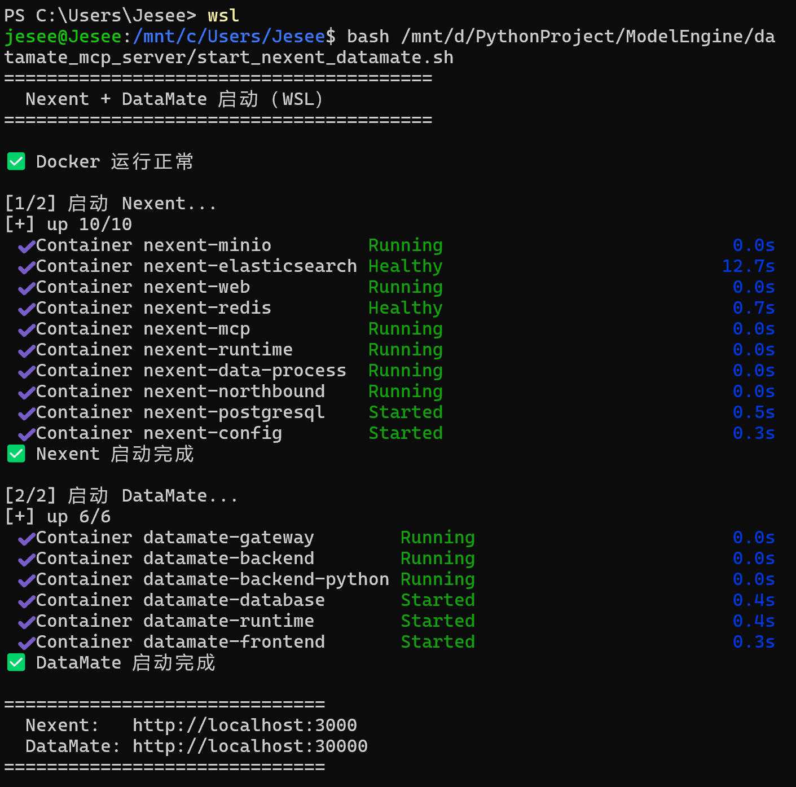

**DataMate MCP Server 启动**

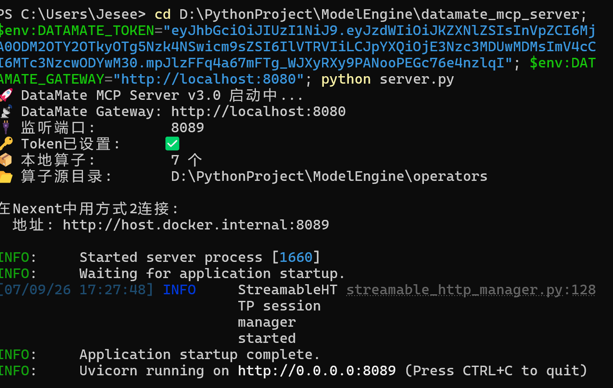

**Nexent 中 MCP 服务器配置**

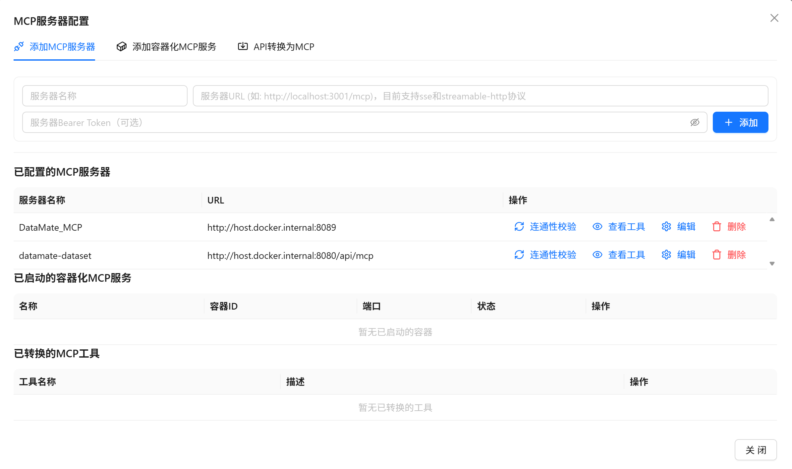

</details>

<details>
<summary>📊 DataMate 算子市场（点击展开）</summary>

| 数据加载算子 | 数据清洗算子 | 数据转换算子 | 数据导出算子 |
|:---:|:---:|:---:|:---:|
| 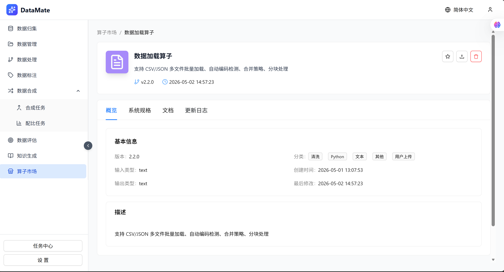 | 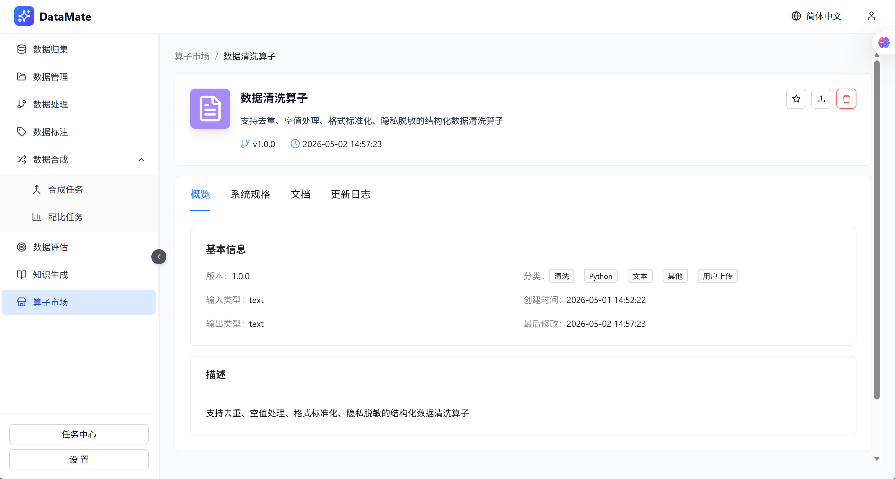<br> | 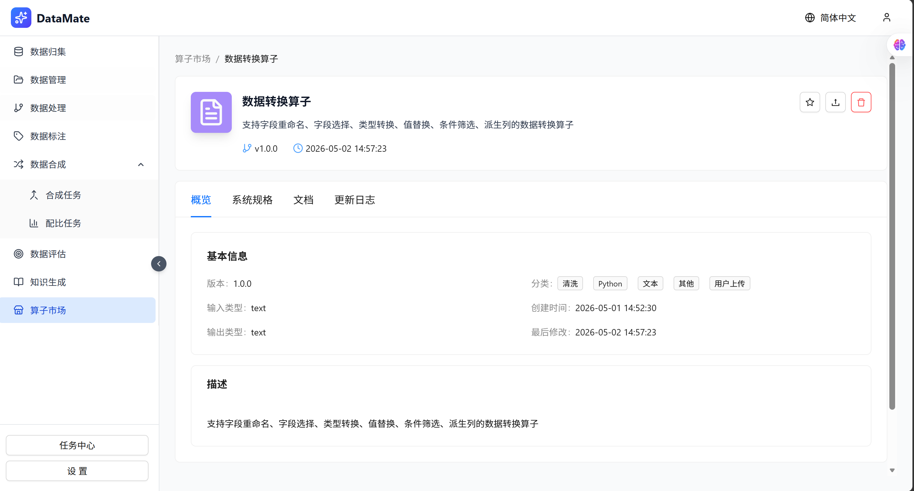 | 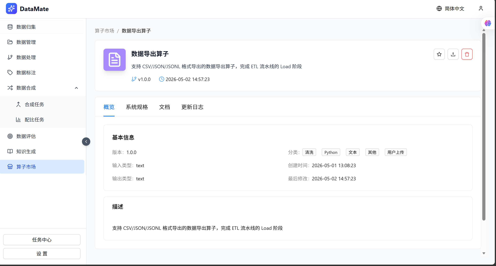 |

| 医疗实体识别算子 | 医疗关系抽取算子 | 知识图谱三元组生成算子 |
|:---:|:---:|:---:|
| 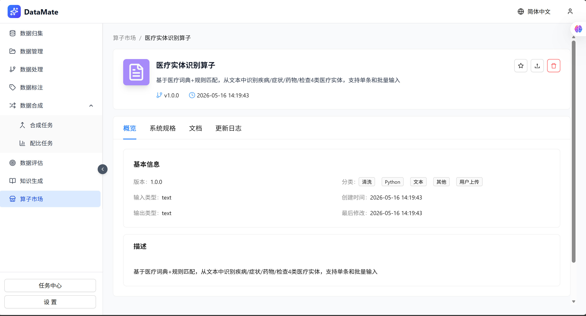 | 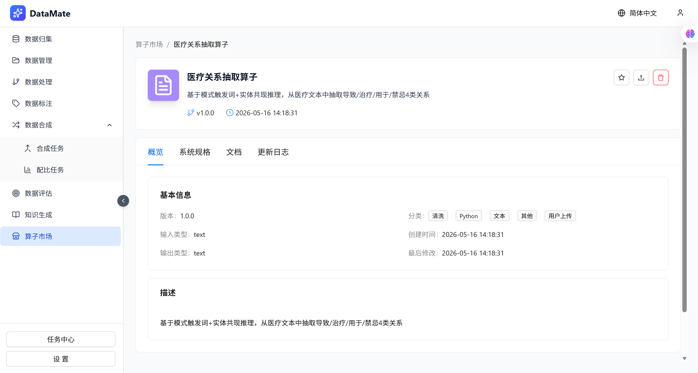 | 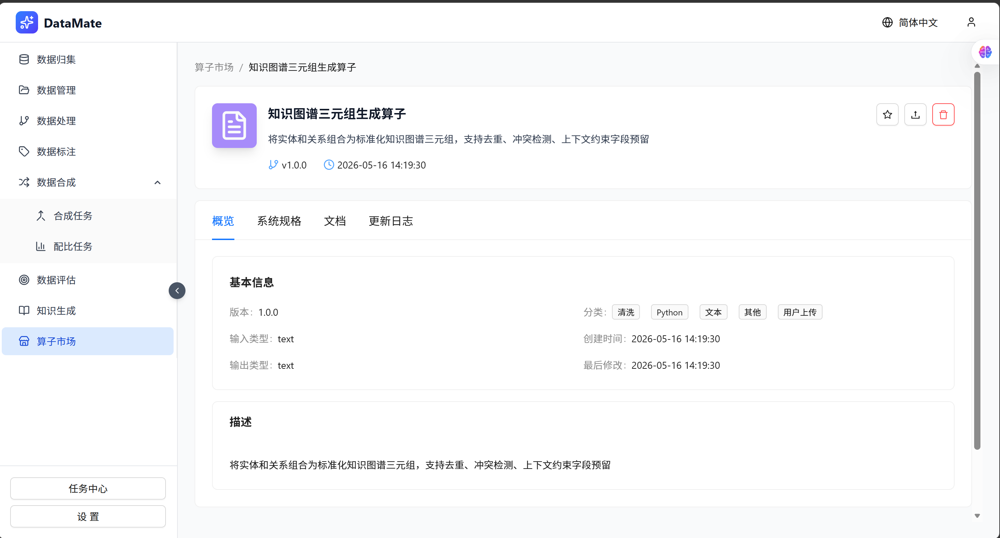 |

</details>

<details>
<summary>🔄 DataMate 任务执行（点击展开）</summary>

**源数据预览**

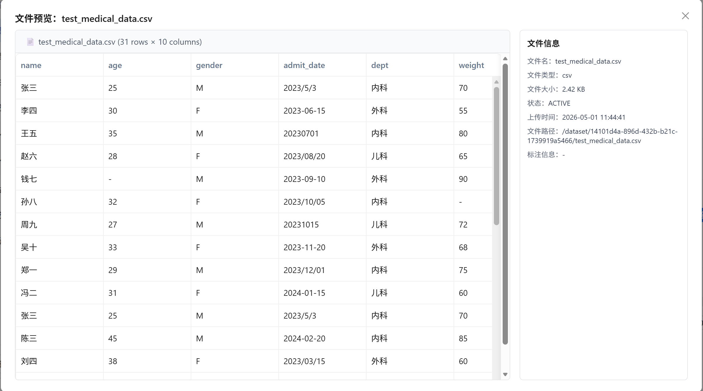

**ETL 任务执行摘要**

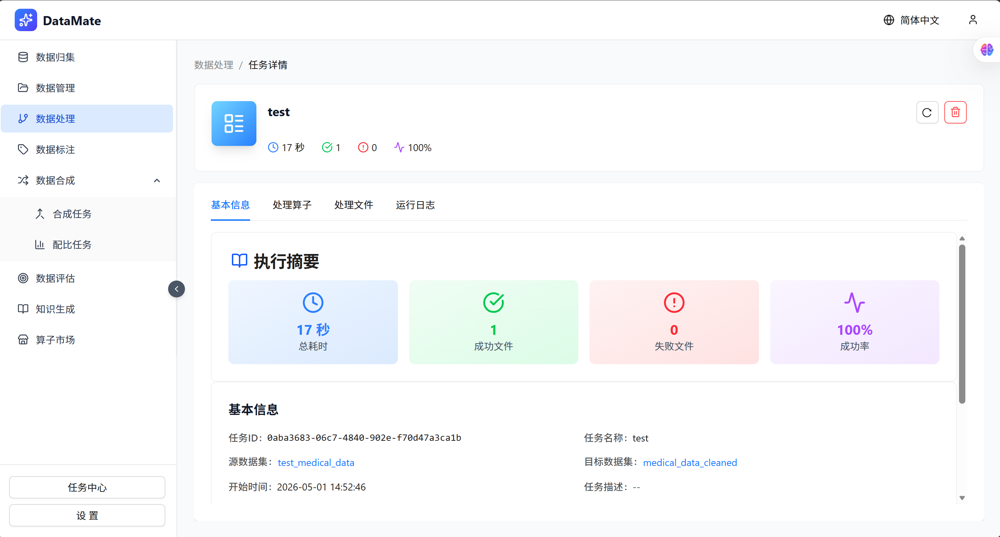

**四步算子执行报告**

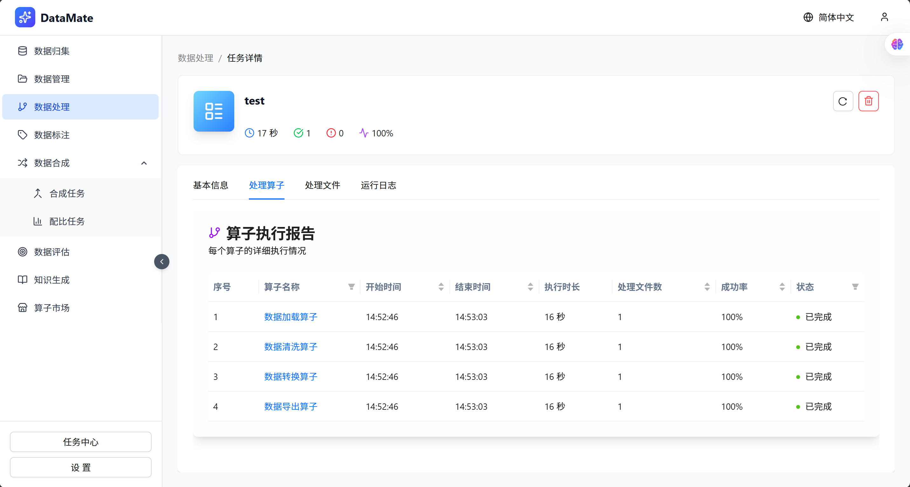

</details>

---

## 📦 补充材料索引

以下材料因文件较大，已压缩上传至**百度网盘**：

| 内容 | 链接 |
|:---|:---|
| 📦 **Nexent + DataMate 魔改源码** | [百度网盘](https://pan.baidu.com/s/11u6vqssLMTMMWRsHpf7rkw?pwd=9r25) |
| 🔑 提取码 | `9r25` |

> 💡 **提示**：仓库内 `extras/` 目录中包含其他可直接使用的补充材料（算子 ZIP、性能评测脚本、ETL Demo），无需从网盘下载。
